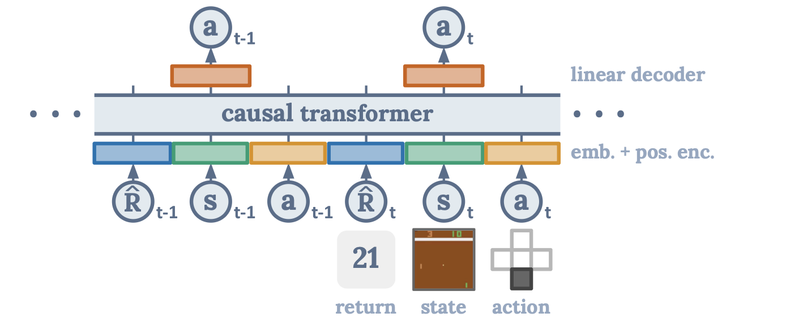
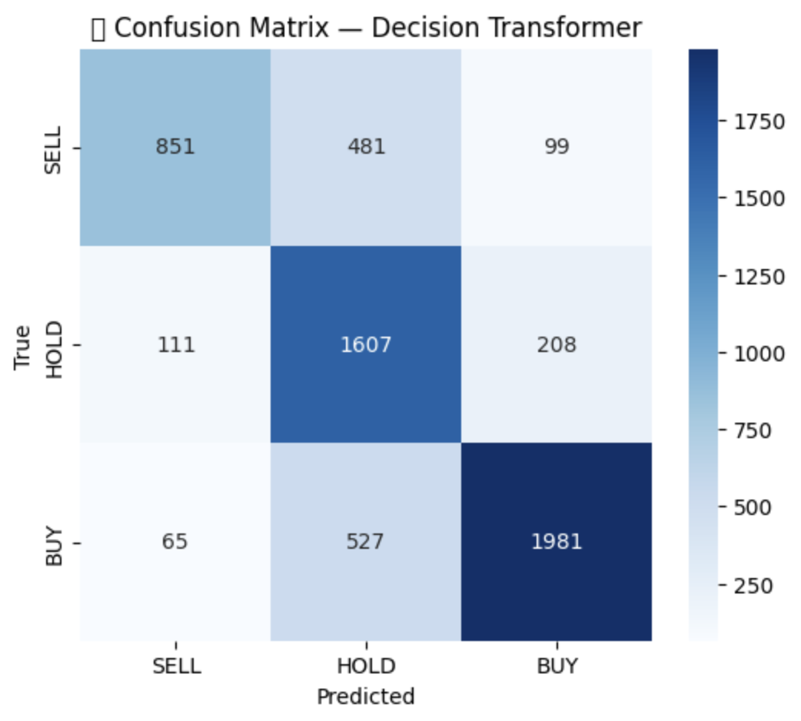
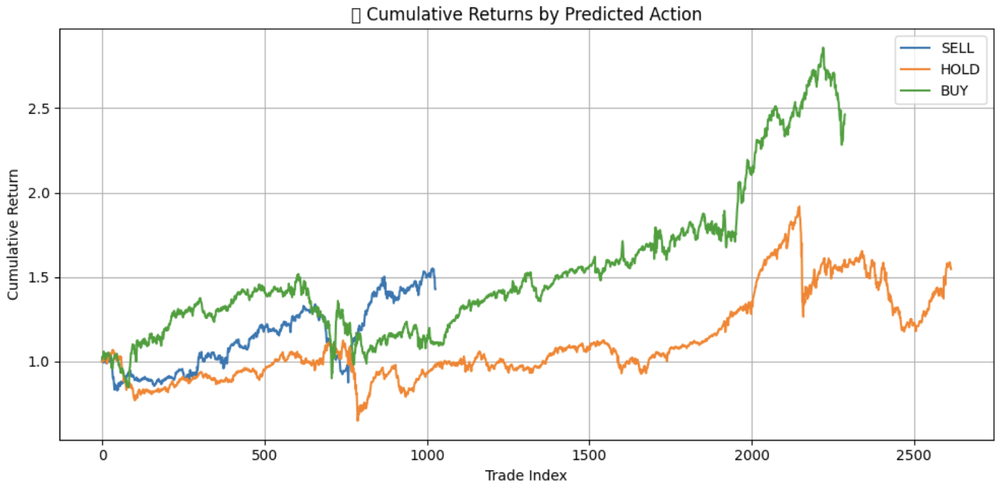

# Decision Transformer for Market Microstructure Timing

Transformer-based market timer that learns microstructure patterns and predicts tactical trading actions (BUY, HOLD, SELL) using only price-volume data. Think of it as a GPT for market states, it studies the current state of the market and predicts how the next day will look like. This is based on exploiting minute price changes in the stock index. The model has been trained on 2000-2023 data, and was validated on 2023-2025. Here is a HuggingFace demo: [link].

Installation guide and results at the end.

What is a Decision Transformer: Simply put -- Reinforcement Learning can be complex, but Offline RL can be simplified as a Sequence Modeling task. Decision Transformers do that with equal or better accuracy than traditional Offline-RL methods.

Please find the Decision Transformer paper here: [Decision Transformer: Reinforcement Learning via Sequence Modeling](https://arxiv.org/abs/2106.01345)

## Highlights
- Trained a Decision Transformer to **time the S&P 500** using OHLCV data.
- Create states represented 18 features engineered using technical analysis.
- Learns short-horizon price action using **RTG-conditioned sequences** of 10-day contexts.
- Predicts discrete trading actions using **autoregressive token-based inference**.
- Evaluated with **equity curves, alpha vs. benchmark returns, and real trading simulation**.
- Deploy-ready architecture built with **PyTorch**, modularized for retraining and evaluation.

## Project Description
This model is inspired by the Decision Transformer architecture adapted to financial markets. It predicts the next trading action by observing past market behavior and conditioning on a target return (RTG). The model uses only price and volume information (~ a total of 18 sophisticated indicators), making it robust to noisy indicators and suited for microstructure-level decision-making.

We simulate how a trader would behave if they had a model that could "look back" at the last 10 days and act optimally to hit a return target.

## Technical Details

###Architecture


NOTE: This image and the model architecture belongs to the authors of the [Decision Transformer Paper](https://arxiv.org/abs/2106.01345)

We feed the last K timesteps into the Decision Transformer, creating 3K tokens (3 modalities) — one each for return-to-go, state, and action at every step. Each of these is first passed through a linear layer to match the embedding size, then normalized. If the input is visual (like images), we use a convolutional encoder instead of a linear layer for the state. Each timestep also gets a learned time embedding added to its tokens (unlike usual positional encodings, since each timestep has 3 tokens). The full sequence is then passed through a custom GPT-style transformer to predict the next action in an autoregressive way.

NOTE: Decision Transfomers are not evaluated in the traditional way. They need to be evaluated in an auto-regressive way as shown in my src/eval.py

### Model Architecture
- **Decision Transformer** using `nn.TransformerEncoder`
- Embedding layers for:
  - **Return-to-Go (RTG)**: `nn.Linear(1, embed_dim)`
  - **State**: `nn.Linear(state_dim, embed_dim)`
  - **Action**: `nn.Embedding(num_actions, embed_dim)`
  - **Timestep**: `nn.Embedding(max_timestep, embed_dim)`
- LayerNorm and Dropout for stability
-FlashAttention for memory optimization
- Additionally, Linear Attention Architectures could be implemented for very long sequences (context lengths), such as for over 1024 trading-day worth of context-length.
- Context length: **10 days** --> upon experimenting on multiple context lengths, while 10 days is easier to train, 45 days (2 full trading months considering around 22 trading days a month) work best for weekly predictions. 

### Input Data
- **OHLCV** features (Open, High, Low, Close, Volume) --> downloaded from yfinance

- states: ['Date', 'Open', 'High', 'Low', 'Close', 'Volume', 'log_return_1d',
        'log_return_intraday', 'gap_open', 'true_range', 'atr_5',
        'volume_zscore_5', 'vol_price_ratio', 'rsi_5', 'rsi_prev',
       'rsi_divergence_flag', 'bb_squeeze_flag', 'bullish_engulfing',
       'bearish_engulfing', 'action', 'position', 'reward', 'rtg']

- Each sequence contains: past 10 states, past 10 actions, and 10 RTGs
- Actions are discrete: `0 = SELL`, `1 = HOLD`, `2 = BUY` --> this is important, as some variants of Reinforcement Learning problems have continuous actions and you would need to adjust the "embedding" layers per se.

### Training
- Optimizer: `AdamW(lr=1e-4, weight_decay=1e-4)`
- Loss: Cross-entropy on predicted action logits
- Epochs: Configurable (typically 5)
- Framework: **PyTorch**

### Evaluation
- **Autoregressive simulation** over historical data
- Metrics:
  - **Achieved vs Target Return**
  - **Daily Return Curve**
  - **Equity Curve**
  - **Alpha vs. Benchmark (Buy & Hold)**
- Optional slippage, transaction cost simulation available

### Results
- This is the confusion matrix, the model predicts when to "HOLD" with very good accuracy, and is sometimes confused when to "SELL", this happens because of the nature of S&P 500, which has shown good growth since the year 2000, and a model trained for predicting markets would get "confused" as the best strategy (without much sophistication) is: "HOLD the S&P 500 for 30 years". The model is able to predict a safe amount of "BUY" calls, where one could profit.



- These are the expected returns you would "have" achieved upon intra-day trading using predictions from the model:



--NOTE: This is not Financial Advice in any form. This is an experiment aimed to understanding how Machine Learning, Deep Learning and Reinforcement Learning methods perform in different domains. Kindly do your own research before making any investing decisions.

## How to Run and Install

```bash
# Clone the repository
git clone https://github.com/kaushikd24/Micro-Time-Transformer.git

# Navigate into the project directory
cd Micro-Time-Transformer

# Install dependencies
pip install -r requirements.txt

# Train the model
python src/train.py --config configs/dt_microstructure.json

# Evaluate the model
python src/eval.py --model_path models/epoch_5.pt
```